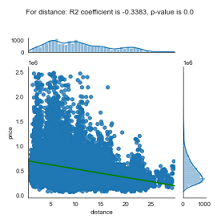
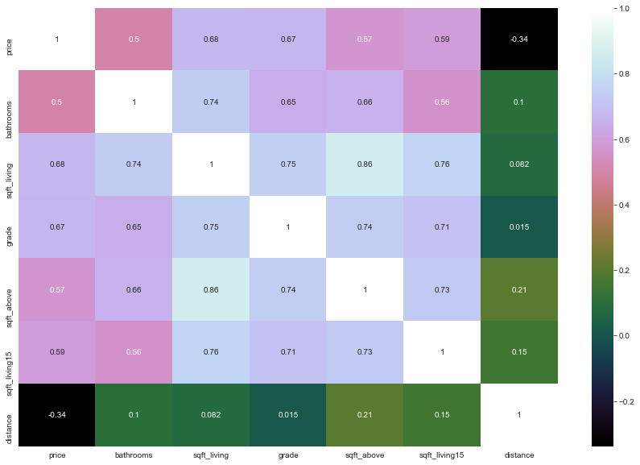
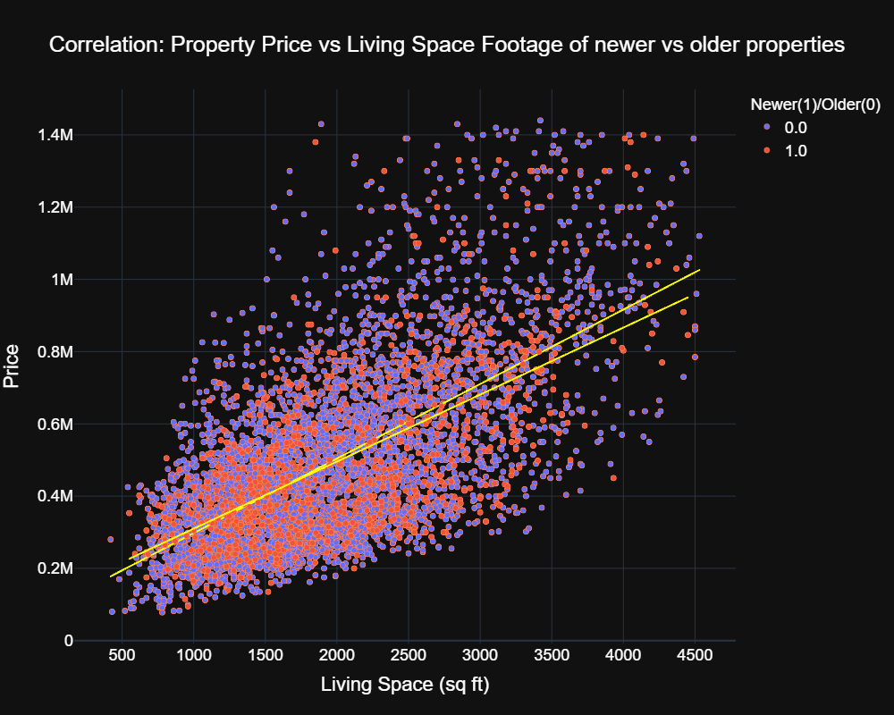

Copyright: <a href='https://www.123rf.com/profile_tomkli'>Thomas Klinder</a>


# <center>Increase Your Property Value and Stretch Your House Buying Budget Further</center>

<span style="color:red; font-size:1.5em">**Phase 2 Final Project**</span><br>
* Student name: <b>Elena Kazakova</b>
* Student pace: <b>full time</b>
* Cohort: <b>DS02222021</b>
* Scheduled project review date/time: <span style="color:red"><b>TBD</b></span>
* Instructor name: <b>James Irving</b>
* Blog post URL: <span style="color:red"><b>TBD</b></span>

## Table of Contents 

*Click to jump to matching Markdown Header.*<br>

- **[Introduction](#INTRODUCTION)<br>**
- **[Obtain](#Obtain)**<br>
- **[Scrub](#Scrub)**<br>
- **[Explore](#Explore)**<br>
- **[Model](#Model)**<br>
- **[iNterpret](#iNterpret)**<br>
- **[Conclusions/Recommendations](#Conclusions-and-Recommendation)<br>**
___

# Introduction
This Project analyses the data on the properties sold in King County, WA (not including the Seattle inner city areas) over the period of one year, from May 2014 till MAy 2015. The resulting model provides insight what features of a property increases its' value and what variables outside of property owners control affect the price of a house.

## Business Problem
This project is the Inference Analysis project of King County, WA house prices, and various factors that might affect the sales price.<br>
This study aims to build a model(s) of house sale prices depending on the features of the property in the dataset provided. This information can be helpful for house owners, house buyers, and real estate agents in the county.

# Obtain

## Data Understanding

The dataset used in this project has been downloaded from [KAGGLE site]( https://www.kaggle.com/harlfoxem/housesalesprediction?select=kc_house_data.csv). The dataset includes the information about properties sold in King County of Washington State between May 2014 and May 2015. The area consists of Seattle city area but does not include the inner city. The dataset consists of 21 dependent and independent variables and 21597 records.


### Description of the fields

The file has 21597 records with 21 columns, out of which 11 columns have integer values, 8 are real numbers, and 2 are strings.<br>
    The annotation to the fields and associated data<br> (link to the definitions [here](https://github.com/emilyageller/king_county_house_prices))
* <b>id:</b> Unique ID for each home sold

    1. no NULL values<br>
    2.integer numbers<br>
    3.176 duplicate records
><span style="color:red"><b>353 rows to be dropped</b></span>

* **date:** Date of the sale
>no NULL values<br>
string<br>

><span style="color:red"><b>Convert to DateTime type</b></span>

* **price** - Price of each home sold
>no NULL values<br>
Real numbers<br>
Minimum price: 78000<br>
Maximum price: 7700000

* **bedrooms** - Number of bedrooms
>no NULL values<br>
>Integer numbers, between 1 and 33

* **bathrooms** - Number of bathrooms, where .5 accounts for a room with a toilet but no shower
>no NULL values<br>
>Real numbers, between 0.5 and 8.0

* **sqft_living** - Square footage of the house interior living space
>No NULL values<br>
Integer numbers<br>
Minimum value: 370<br>
Maximum value: 13540

* **sqft_lot** - Square footage of the land lot
>No NULL values<br>
Integer numbers<br>
Minimum value: 520<br>
Maximum value: 1651359

* **floors** - Number of floors
>no NULL values<br>
>Real numbers, between 1.0 and 3.5

* **waterfront** - A categorical variable for whether the house was overlooking the waterfront or not
>**2376** NULL values<br>
>Real numbers, only two values 1.0 and 0.0<br>

><span style="color:red"><b>Convert to a categorical variable<br>
Waterfront, not Waterfront</b></span><br><br>
><span style="color:red"><b>Replace NULL values with "Missing" category</b></span>

* **view** - A categorical variable describing how good the view of the property was
>**63** NULL values<br>
>Real numbers: 1.0, 2.0, 3.0, 4.0<br>

><span style="color:red"><b>Convert to a categorical variable<br>
Poor, Fair, Good Excellent</b></span>

><span style="color:red"><b>Replace NULL values with "Missing" category</b></span>

* **condition** - A categorical variable describing the condition of the house
>no NULL values<br>
>Integer numbers, between 1 and 5<br>

><span style="color:red"><b>Convert to a categorical variable<br>
Poor, Fair, Good, Very Good, Excellent</b></span>

* **grade** - A categorical variable describing the quality of construction, from 1 to 13; 1-3 falls short of building construction and design, 7 has an average level of construction and design, and 11-13 have a high quality level of construction and design.
>no NULL values<br>
>Integer numbers, between 3 and 13<br>

* **sqft_above** - The square footage of the interior housing space that is above ground level
>No NULL values<br>
Integer numbers<br>
Minimum value: 370<br>
Maximum value: 9410

* **sqft_basement** - The square footage of the interior housing space that is below ground level
>No NULL values<br>
String<br>

><span style="color:red"><b>Convert to integer</b></span><br>

* **yr_built** - The year the house was initially built
>No NULL values<br>
Integer numbers<br>
Minimum value: 1900<br>
Maximum value: 2015

* **yr_renovated** - The year of the last house renovation
>**3842** NULL values<br>
>Real numbers, between 0.0 and 2015.0<br>

><span style="color:red"><b>Convert to integer</b></span><br>

* **zipcode** - What zipcode area the house is in
>no NULL values<br>
Integer numbers, 70 unique values<br>

><span style="color:red"><b>Convert to categorical variable or drop</b></span>

* **lat** - Lattitude
>no NULL values<br>
>Real numbers

* **long** - Longitude
>no NULL values<br>
>Real numbers

* **sqft_living15** - The square footage of interior housing living space for the nearest 15 neighbors
>No NULL values<br>
Integer numbers<br>
Minimum value: 399<br>
Maximum value: 6210

* **sqft_lot15** - The square footage of the land lots of the nearest 15 neighbors
>No NULL values<br>
Integer numbers<br>
Minimum value: 651<br>
Maximum value: 871200


<br><br>

### <i>Initial cleaning of the data</i>

* 1. Dropping duplicate rows for houses sold twice in the timeframe of the dataset

* 2. Converting the 'date' field to DateTime formate and making sure it worked

* 3. Locations of the houses with missing 'waterfront' values

>> Possible strategies:<br>
* Check if there are waterfront properties among neighbors within a certain distance range
* Make a map and place properties with missing values on it visually
* What is the longitude of the bay shore? Any house with a missing value too far away from it 
should have their waterfront value set to 0. Hopefully, it will eliminate most of the missing values in this field<br>
<br>
<u>The choice is option 2 as the simplest of the three:</u>
##### 3.1 Visual assesment of the houses with Null value in the 'waterfront column


<div class="alert alert-block alert-danger">It is self-evident from the visuals above that the vast majority of the houses are located inland. Simple zooming in the maps allows a rough counting of alleged waterfront properties. The estimate is approximately 20 waterfront houses. It is 0.85% of all properties with no value in 'waterfront column (2353). In the primary dataset, the percentage of waterfront properties out of the total number of properties is 0.68%. The numbers above indicate that replacing the NaN values with 0 would introduce a systemic error of 0.01% to the whole system.<br><br>
    <b>Conclusion:</b> The NULL values in the 'waterfront' column will be replaced with 0.
    </div><br>

##### 3.2 NULL values in 'waterfront' column replaced with 0 and the column converted to the integer datatype to make it categorical<br><br>


##### 3.3 Replacing NULL values in waterfront and view field using IterativeImputer (testing the approach)

<br>
<div class="alert alert-block alert-danger">
    <b>Conclusion:</b>  Based on the results of the IterativeImputer application to the data the original approach of replacing missing values in 'waterfront', 'yr_renovated', and 'view'  with 0 will be taken<br>    </div>
<br>

#### 4. NULL values in 'yr_renovated column' replaced with 0 and the type changed to integer
#### 5. '?' values in 'sqft_basement' column replaced with 0 and the type changed to integer
#### 6. NULL values in 'view' column replaced with 0 and the type changed to integer

<br><br>

# Scrub and Explore

## Additional data cleaning

**Dropping non-needed fields**


> Dropping 'zipcode' variable because there are better indicators of a location.
Zipcodes boundaries are usually drawn out of convenience for postal services or
other more formal reasons than geographic location

>Dropping 'id' field


<br>

## Exploring distributions and correlation of original variables
<br>

### Numerical variables: Investigating distributions and correlations between the original, minimally processed predictors and the target (price) 
<br>

Histograms of the original predictor variables


<br>

**Based on the histograms above**
> 1. The following variables should be considered categorical:
>>Waterfront<br>
Condition<br>
View<br>
> 2. sqft_basement, sqft_lot, sqft_lot15, and yr_renovated have a large number of zeros and are strong candidates for removal of outliers and/or engineered variables<br>
> 3. Latitudes and Longitudes can be used as descriptors of a geographic location of a property. However, there is  a better variable to describe the location of a property, a distance from the center of the city, which can be calculated from geocoordinates.<br>
    >4. The target variable, the price of the property, has a strong positive skew attributed to outliers in the higher price bracket. The strategy is to **remove the outliers and to transform the variable** to make it more normally distributed

<br><br>

 

#### **A new categorical variable (integer datatype) **renovation_done** with values [0,1,2,3,4] is created**

* 0 representing renovation never done on houses more than 9 years old (yr_built between 2015 and 2006)
* 1 representing renovation done more than or equal 50 years ago
* 2 representing renovation done between 30 and 49 years ago
* 3 representing renovation done between 29 and 10 years ago
* 4 representing renovation done between 9 and 1 year ago OR houses built less or equal 9 years ago (yr_built between 2015 and 2006)

<br>

**sqft_basement, date, latitude & longtitude variables are dropped**

<br>

**Coefficients of Determination and p-values for the remaining variables**
* For price: R2 coefficient is 1.0, p-value is 0.0
* For bedrooms: R2 coefficient is 0.3195, p-value is 0.0
* For bathrooms: R2 coefficient is 0.4999, p-value is 0.0
* For sqft_living: R2 coefficient is 0.6795, p-value is 0.0
* For sqft_lot: R2 coefficient is 0.1565, p-value is 7.279024950162686e-110
* For floors: R2 coefficient is 0.2657, p-value is 1.2233e-320
* For grade: R2 coefficient is 0.6726, p-value is 0.0
* For sqft_above: R2 coefficient is 0.5746, p-value is 0.0
* For yr_built: R2 coefficient is 0.0348, p-value is 8.471205832359682e-07
* For sqft_living15: R2 coefficient is 0.5951, p-value is 0.0
* For sqft_lot15: R2 coefficient is 0.1512, p-value is 1.1950868785722046e-102
* For distance: R2 coefficient is -0.3432, p-value is 0.0

<br>

**Plotting numerical variables against the target variable**
<br>

 
     
<br>


*It is evident from the visualization that 'floors' and 'sqft_lot' do not display a strong correlation with the target*
<br>

**Numerical predictors correlation with the price and with each other presentes as a heatmap**
<br>


*Bedrooms is relatively highly correlated with bathrooms and sqft_living; correlations of floors, sqft_lot and sqft_lot15 with prices are low. Dropping these variables*
<br><br>

**Heatmap of the remaining variables**
<br>


<br>

**KDE and distribution plots of the remaining variables**

   
<br>


<div class="alert alert-block alert-info">All but one variable (distance) are left shifted, which is indicated by the skewness values >1, with price has the most skewed distribution. Because the skewness it to the left (positive values), the log transformation might be needed to normalize the variables. Kurtosis values for all variables are different from 0 (Pearson's definition of kurtosis of a normal distribution). <br>
    Price distribution is highly <b>Leptokurtic</b>, other variables are slightly <b>Leptokurtic</b> (sqft_living, sqft_above, sqft_living15, grade), slightly <b>Platykurtic</b> (distance) or almost <b>Mesokurtic</b> (bathrooms)</div>

<br>

**Diamond box plots for descrete numerical variables**


<div class="alert alert-block alert-info"> Based on the distribution plots, variable 'bathroom' has a symmetrical distribution (Skewness is 0.28), with a very low kurtosis (0.09) indicative of a <b>Mesokurtic</b> curve (Gaussian distribution has a kurtosis of 0 by Pearson's definition used by scipy.stats.kurtosis method)<br>
Variable 'grade' is slightly skewed to the right (0.73) and relatively low kurtosis, slightly above 1.<br>
The pronounced correlation of these variables with the price is identifiable in the box plots above. The plots show that the numbers of outliers in the distribution of the variables are reasonable. Both variables have a wider range of values in the higher price brackets.</div>

<br><br>

### Numerical variables: Exploring Mutual Correlation Coefficients and Variance Inflation Factor
<br>

**Using VIF as an indicator of collinearity between independent variables**


* Dropping the columns that have high VIF. However, it is more logical to leave sqft_living versus sqft_living15 in because it is easier to interpret in a model and it is a feature under control of a property owner (versus sqft_living15 which is a charecteristic of a neighborhood)

*After dropping the fields*


<br>
<br>

**Pearson coefficients analysis of the remaining independent variables**
<br>

* For bathrooms: R2 coefficient is 0.4989, p-value is 0.0
* For sqft_living: R2 coefficient is 0.6794, p-value is 0.0
* For grade: R2 coefficient is 0.6726, p-value is 0.0
* For distance: R2 coefficient is -0.3383, p-value is 0.0
* For price: R2 coefficient is 1.0, p-value is 0.0

<br>

**Heatmap of the remaining predictor and the target**


<br>
<br>


<div class="alert alert-block alert-danger">Mutual correlation coefficients between the remaining independent variables are 
slightly higher or below 0.7. I am leaving sqft_living, grade, and bathroom variables in because of their logical connection with a property price despite their multicollinearity (0.74 & 0.73 are above the 0.7 threshold).<br><br>

*Therefore the remaining numerical variables for <u>modeling</u> are<br><br>*
<b>1. grade<br>
2. bathrooms<br>
3. sqft_living<br>
4. distance<br></b>
    </div>

<br><br>

### Categorical variables: Investigating distributions and the raw correlations between the original, minimally processed predictor and the target (price)

*Original categorical variables:*<br>
* waterfront
* view
* condition
* basement_exists
* renovation_done
* month
<br><br>

**Visual investigation of the box plots**

     


<div class="alert alert-block alert-info"> Based on the plots, it is self-evident that 'month', 'condition' and 'basement_exists' variables do not significantly affect the price of the properties and can be dropped from the categorical variables.<br>
Variable 'waterfront' is also dropped becasue waterfront properties represent a tiny portion of all properties in the dataset
</div>
<br><br>

**The remaining categorical variables, grade, view, and renovation_done are dummed out with OheHotEncoder**
<br><br>


# Model

## Data Modeling


### Baseline model

><i><b>“Everything should be made as simple as possible, but no simpler.”</b></i><div style="text-align: right">Albert Einstein</div>

The chosen baseline model is a model with only one numerical variable, grade.

**Creating a model**
<br><br>


<div class="alert alert-block alert-info"> The baseline model has a coefficient of determination of 0.452, indicating that roughly 45% of the observations fit the model. F-statistics is very high that indicates that the baseline model is a significant improvement of the  "intercept only model"<br>
    The Skewness and the Kurtosis values indicate non-normal distribution of the target variable<br>
    QQ plot is also indicative of the abnormal distribution of the residuals, especially in the upper Quantile
</div>
<br><Br>

### Model 1 (all numerical variables considered significant, see Explore section)
<br>

**Model summary**
<br>


<br>


<br><br>

<div class="alert alert-block alert-info"> 
The summary of the model above indicates that<br>
    1. All the independent variables coefficients and the intercept value are significant (p-values< 0.05)<br>
    2. The coefficient of determination (R2) is not very high, but it is significantly higher than R2 of the baseline model. It indicates that about 66.8 percent of the observations fall within the regression line <br>
    3. The skew and the Kurtosis values indicate the highly non-normal distribution of the target variable<br>
    4. The high value of JB coefficient also indicates that the data is highly non-normal <br>
</div>
<br>
<div class="alert alert-block alert-info"> 
From the model's QQ plot, it is also quite obvious that the 'price' target variable is not normally distributed. A steep swing up indicates that the higher-priced houses are less likely to fit the baseline model and are more spread out. One possible reason might be <b>an unusually large number of outliers in the dataset</b></div>
<br>

<div class="alert alert-block alert-danger"><b>There are two potential approaches that can be taken</b><br>
        1. Normalization by either log or square root transformation<br>
        2. Removal of outliers</div>

<br><br>

**Accessing linearity of model predictors' relationship with the target and their homoscedasticity**
<br>

  

<br>

<div class="alert alert-block alert-info"> The results indicate that all of the predictors display linear relationship with the target. The distance, sqft_living and bathrooms variables display less  heteroscedasticity than the grade variable does.<br><br></div>
<div class="alert alert-block alert-danger"><b>There might be several appropriate ways to address this issue</b><br>
    1. Log transformation of the target and/or independent variables<br>
    2. Using either Generalized Least Squares or Weighted Least squares<br>
    3. Bootstrapping<br>
<br><br>

### Model 2 (adding categorical variables)
<br>

**Model Summary**
<br>

<br>


<div class="alert alert-block alert-info">The summary indicates a very slight improvement over the previous model, 66.9% versus 66.8% of all of the observations fall within the results of the line formed by the regression equation.<br><br>
    It is also evident that p-values of most of the categorical values are very high, indicating their insignificance in the model. However, because they describe the same feature, I am leaving them in for now<br><br>
The residuals normality did not improve</div>
<br>


### Model 3 (preprocessing and removal of outliers)
<br>

*Outlier removal by IQR method*
<br>

**Model Summary**
<br>

<br>


<div class="alert alert-block alert-info"> While the IQR removal of outliers decreased the R squared of the model, it made the distribution more normal (Skew and Kurtosis values are almost within the normality ranges). This fact is also reflected by the QQ plot of the model residuals. Unfortunately, the Coefficient of Determination dropped.</div>
<br>

*Outlier removal by Z-scores method*
<br>

**Model Summary**
<br>

<br>


<br>

<div class="alert alert-block alert-info"> 
The R squared of the model is 0.654 and F-statistics is higher than for the previous model
    <br>The IQR method of outliers removal made the residual distribution more normal than Z-score method due to the former having more strict criteria. The decision is to use the dataset compiled after Z-score outlier removal. 
<br>
<br>
</div>
<div class="alert alert-block alert-danger"><b>The next step is functional transformation of the target variable</b><br>
</div>
<br><br>

### Model 4 (Using log and square root transformations on the target variable)
<br>

*Log Transformation*
<br>

 
<br>


<div class="alert alert-block alert-info"> 
The transformation worked well, improving the normality of the 'price' variable. Log_price distribution looks more symmetrical. Skewness improved dramatically (from 1.18 to -0.01, 0 being perfectly symmetrical)
<br><br>
 Kurtosis value decreased, making the curve more Mesokurtic (close to a Gaussian curve). It is an expected effect of log transform.
</div>
<br><br>
<div class="alert alert-block alert-danger"><b>The next step is test a square root transformation.</b><br>
</div>
<br>

*Square Root Transformation*
<br>

 
<br>


<div class="alert alert-block alert-info"> 
The square root transformation also worked well in improving the normality of the 'price' variable. 
sqrt_price distribution looks more symmetrical. Skewness improved dramatically (from 1.18 to -0.59, 0 being perfectly symmetrical)
<br>
 However, both of the parameters are worse that the parameters of log_price distribution.
</div>
<br>

<div class="alert alert-block alert-danger"><b>The next step is create two separate models and to see if the transformations made a difference</b><br>
</div>
<br>

*Model using log transformed target variable*
<br>
**Model Summary**
<br>


<br>

*Model using square root transformed target variable*
<br>
**Model Summary**
<br>


<br>

*QQ plots for the models*
<br>


<br>


<br>


<div class="alert alert-block alert-info"> 
Both models improved the R squared and the F-statistics of the previous models. The residuals of both models display a close-to-normal distribution. Log transformation helped improve the upper part of the distribution, while square root transformation worked better in the lower part of the distribution. 
<br><br>
R squared of the square root transformation-based model is slightly higher, while its kurtosis value is slightly worse than the kurtosis value of the log-transformed price model. The decision is to use the log-transformed target variable.
</div>
<br>

<div class="alert alert-block alert-danger"><b>The next step is to remove unnecessary categorical variables, scale the remaining variables, and built the last model with coefficients in the regression model, which are easy to compare and interpret</b><br>
</div>
<br><br>

*Final Model*
<br>

**Model Summary**
<br>


<br>

*QQ plot of the residuals*
<br>


<br>

*Regression plots and visualization of homoscedasticity*
<br>

 
<br>

<div class="alert alert-block alert-info"> 

The final linear regression model of a log of the price variable versus grade, bathrooms, distance from the center of the city, sqft_living space, and the indicator if a house has been renovated recently or a newer house has a Coefficient of Determination of 0.663. It is indicative of the fact that 66.3% of the sold properties fall within the results of the line formed by the regression equation. F-statistics displays the high value and the overall p-value much lower than the confidence interval 
<br><br>
The independent variables used in the equation display a clear linear relationship with the target and homoscedasticity.
</div>
<Br><Br>

<div class="alert alert-block alert-danger"><b>The next step is to validate the model by using training and test datasets</b><br>
</div>
<br>


## Train the model
<br>

The model was trained by using SciKit Learn train_test_split model resulting in the following parameters: 
<br>


<br><br>


### Validation


>Train MSE: 0.272<br>
Test MSE: 0.272<br>
Are equal down to the third decimal digit indicating a good agreement between the training and the test sets<br><br>
<b>R</b> squared for for the prediction on the full dataset is the same as in model_4_3: 0.663<br>
<b>Mean Absolute Error</b> for the prediction on the full dataset is 0.213 which is not great but acceptable. The best possible theoretical value is 0.<br>
<b>Mean Squared Error</b> for the prediction on the full dataset is 0.074. The >best possible theoretical value is 0.

<br><br><br>


# iNterpret
<br>

The final model has a reasonable predictive ability tested in the final step of the model validation. MSE, MAE, and R2 score along with the model p-values for all predictors indicate a good fit.<br><br>
The most influential predictor is a **building grade**, following by a **living space footage**. Both factors are **positively correlated** with the price of the property. Both factors are within property owners' control when they are renovating their houses.<br>A **distance** from the center of the city is **negatively correlated** with the price of property, meaning the further away a property is, the lower is the price. It is not a controllable variable but is helpful for home buyers if the living space and the number of bedrooms/bathrooms are important.<br> A **number of bathrooms** has a **positive effect** on the price of a property, but it is not as strong as the first two factors. This fact indicates that the convenience of having multiple bathrooms is essential for potential buyers and should be taken into account when owners are planning a renovation.<br>
The last predictor in the model is an indicator of whether a property **has been renovated recently or a new construction**. It is very **weakly negatively correlated** with the price variable. The negative correlation (reduction of the price) might be related to the following factors: newer properties, on the average, are of less building quality.<br>
**The intercept** of the model is a **bias** of the model and can be interpreted as an offset of the model due to other factors not taken into account for various reasons.
<br><br>

# Conclusions and Recommendation

**Recommendations to property owners planning a renovation to their properties:**
* Increase the living space of your property
* Do the renovation with higher building quality
* Consider adding a bathroom

**Recommendations to potential buyers:**
* Look for properties further away from the city center to make the best out of your property buying budget
* Properties in some zipcodes of the city are more affordable than others at the same distance from the city center
* Properties in some zipcodes of the city are more affordable than others with a better view, more considerable property lots, and with older houses of better quality construction if these factors are essential to a buyer

**Limitations of the model:**
* The original dataset does not include other important factors, and therefore the model is biased
* Multiple linear regression models, while easily interpretable, are limited in their predictive ability
* Some variables in the dataset are strongly correlated with each other, and that affect the predictive power of the model

**Suggestion for future improvements**:
* Add variables to the original dataset like kitchen renovation, average commute time, crime index, average nearby public school quality, etc.
* Update the dataset with more current data

<br><br>

## Appendix
<br>

**Visualization**
<br>

*Regplots for all four variables*
<br>


<br>

*Correlation: Property Price vs Living Space Footage*
<br>


<br>

*Correlation: Property Price vs Number of Bathrooms*
<br>


<br>

*Correlation: Property Price vs Distance from the City Center*
<br>


<br>

*Correlation: Property Price vs Living Space Footage of newer vs older properties*
<br>


<br><br>

*3D plot: Living Space Footage, Number of Bathrooms and Grade of Sold Properties*
<br>


<br><br>

*Map of Properties Sold in King County in 2014-2015*
<br>


<br><br>


*Average Prices of Sold Properties per Zipcode (King County, 2014-2015)*
<br>


<br><br>

*Average Living Space of Sold Properties per Zipcode (King County, 2014-2015)*
<br>


<br><br>

*Average Lot Size of Sold Properties per Zipcode (King County, 2014-2015)*
<br>


<br><br>

*Average Year Built of Sold Properties per Zipcode (King County, 2014-2015)*
<br>


<br><br>

*Average View Category of Sold Properties per Zipcode (King County, 2014-2015)*
<br>


<br><br>

## For More Information

Please review our full analysis in [our Jupyter Notebook](./project2_OSEMN_plus_mvp_final.ipynb) or our [presentation](./DS_Phase2_Project_Presentation.pdf).

For any additional questions, please contact **Elena Kazakova @ e.v.kazakova@gmail.com**

## Repository Structure
 

```
├── LICENSE.md                                             <- Learn.co Educational Content License
├── README.md                                              <- The top-level README for reviewers of this project
├── README.pdf                                             <- The top-level README for reviewers of this project in PDF format
├── project2_OSEMN_plus_mvp_final.pdf                      <- Final Project Jupyter notebook as a PDF file
├── project2_OSEMN_plus_mvp_final.ipynb                    <- Final Project Jupyter notebook
├── project2_OSEMN_plus_mvp_final_backup.ipynb             <- The latest backup of the notebook
├── DS_Phase2_Project_Presentation.pdf                     <- PDF version of project presentation
├── directory structure.txt                                <- Text fiel with this directory tree
├── repo.pdf                                               <- Github repo structure image
├── old_files                                              <- Files not in use
├── data                                                   <- original data files and GeoJSON file
└── images                                                 <- Both sourced externally and generated from code
```
